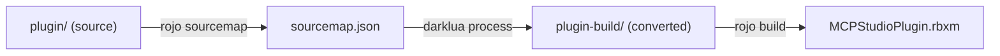

# Darklua Plugin Build Pipeline

## Problem

`plugin/msgpack.luau` uses `require("../Packages/msgpack-luau")` -- a path-based require that only darklua can convert to the Roblox instance-based `require(script.Parent.Packages['msgpack-luau'])`. The test build already does this (sourcemap -> darklua -> rojo build), but the actual plugin build skips darklua entirely, producing a broken `.rbxm`.

## Architecture

The pipeline (already working for tests) needs to be applied everywhere:




## Changes

### 1. Rename darklua config

Rename `[.darklua-tests.json](.darklua-tests.json)` to `.darklua.json` -- it is now the shared config for all builds, not just tests. Content is identical.

### 2. Create `plugin-build.project.json`

Like `[plugin.project.json](plugin.project.json)` but pointing at `plugin-build/` (the darklua output):

```json
{
  "name": "MCPStudioPlugin",
  "tree": {
    "$path": "plugin-build",
    "Packages": {
      "$path": "Packages"
    }
  }
}
```

### 3. Rewrite `build.rs`

Replace librojo library usage with CLI shell-outs (rojo sourcemap, darklua, rojo build). This also lets us drop `rojo = "7.6.1"` from `[build-dependencies]` in `[Cargo.toml](Cargo.toml)`, removing a massive dependency subtree and speeding up clean builds.

New flow in `[build.rs](build.rs)`:

1. `rojo sourcemap plugin.project.json -o sourcemap.json`
2. `darklua process --config .darklua.json plugin plugin-build`
3. `rojo build plugin-build.project.json -o $OUT_DIR/MCPStudioPlugin.rbxm`

### 4. Update scripts

`**[scripts/build-test-place.sh](scripts/build-test-place.sh)` / `[.ps1](scripts/build-test-place.ps1)**`: Change `.darklua-tests.json` to `.darklua.json`.

`**[scripts/install-plugin.sh](scripts/install-plugin.sh)` / `[.ps1](scripts/install-plugin.ps1)**`: Add sourcemap generation and darklua processing before rojo build; build from `plugin-build.project.json` instead of `plugin.project.json`.

### 5. Update `.github/workflows/ci.yml`

- `**build-and-test` job**: Add Rokit setup + `wally install` steps (required because `build.rs` now shells out to rojo/darklua).
- `**luau-tests` job**: Change `.darklua-tests.json` reference to `.darklua.json`.

### 6. Update `.github/workflows/release.yml`

- `**build-plugin` job**: Add `wally install`, sourcemap generation, and darklua processing before rojo build. Build from `plugin-build.project.json`.
- `**build` (Rust) job**: Add Rokit setup + `wally install` steps.

### 7. Delete legacy files

- `.darklua-tests.json` (replaced by `.darklua.json`)

### Files kept (not removed)

- `test-place.project.json` -- still used for dev and test sourcemap generation
- `test-place-build.project.json` -- still used for test place builds
- `plugin.project.json` -- still used for sourcemap generation (references source `plugin/`)

