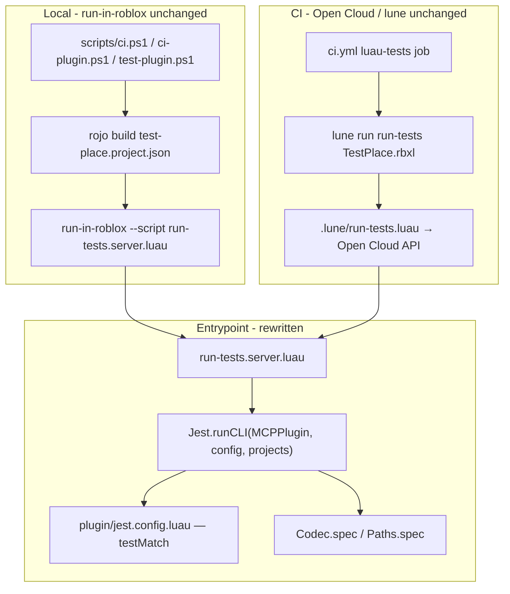

# Jest Lua Migration

## Architecture




## What Is NOT Changing

- `rokit.toml` — `run-in-roblox` stays
- `scripts/ci.ps1`, `ci.sh`, `ci-plugin.ps1`, `ci-plugin.sh`, `test-plugin.ps1` — all unchanged; they call `run-in-roblox --script run-tests.server.luau` which works regardless of what's inside
- `.github/workflows/ci.yml` — `luau-tests` job already uses lune + Open Cloud
- `.lune/run-tests.luau` + `.lune/opencloud-execute/` — not TestEZ-specific
- `test-place.project.json` ServerScriptService entry — `run-tests.server.luau` filename is unchanged

## Files to DELETE

- `[plugin/runTests.luau](plugin/runTests.luau)` — TestEZ runner wrapper, no longer needed
- `[testez.yml](testez.yml)` — Selene global definitions for TestEZ; obsolete once `std = "roblox+testez"` is removed

## Files to Rewrite / Create

### `[wally.toml](wally.toml)`

```toml
[package]
name = "usergenerated/mcp-studio-plugin"
version = "0.1.0"
registry = "https://github.com/UpliftGames/wally-index"
realm = "shared"

[dev-dependencies]
Jest = "jsdotlua/jest@3.10.0"
JestGlobals = "jsdotlua/jest-globals@3.10.0"
```

After editing, run `wally install` to populate `DevPackages/`.

### `[test-place.project.json](test-place.project.json)`

Rename the `"Packages"` DataModel key to `"DevPackages"` (it already points to `DevPackages/` on disk, and `run-tests.server.luau` will now reference `DevPackages`):

```json
{
  "name": "MCPStudioPlugin Test Place",
  "tree": {
    "$className": "DataModel",
    "ReplicatedStorage": {
      "MCPPlugin": { "$path": "plugin" },
      "DevPackages": { "$path": "DevPackages" }
    },
    "ServerScriptService": {
      "RunTests": { "$path": "run-tests.server.luau" }
    },
    "Players": {
      "$properties": { "CharacterAutoLoads": false }
    }
  }
}
```

### `[run-tests.server.luau](run-tests.server.luau)`

Confirmed API from jsdotlua source and docs: `runCLI(root, options, projects)` where `projects` is an array of directories each containing a `jest.config` module. `result.results.numFailedTestSuites` and `result.results.numFailedTests` are the correct fields.

```lua
local ReplicatedStorage = game:GetService("ReplicatedStorage")
local Jest = require(ReplicatedStorage.DevPackages.Jest)

local processServiceExists, ProcessService = pcall(function()
	return game:GetService("ProcessService")
end)

local testRoot = ReplicatedStorage.MCPPlugin

local status, result = Jest.runCLI(testRoot, {
	verbose = true,
	ci = true,
}, { testRoot }):awaitStatus()

if status == "Rejected" then
	print(result)
end

if status == "Resolved"
	and result.results.numFailedTestSuites == 0
	and result.results.numFailedTests == 0
then
	if processServiceExists then
		ProcessService:ExitAsync(0)
	end
	return nil
end

if processServiceExists then
	ProcessService:ExitAsync(1)
end

error("Tests failed")
```

Note: `error("Tests failed")` is a fallback for environments where ProcessService is unavailable (matching the original TestEZ behavior of throwing on failure).

### NEW: `[plugin/jest.config.luau](plugin/jest.config.luau)`

The third argument to `runCLI` is *"directories with a `jest.config` module"* — this file is required. Rojo will include it automatically as `ReplicatedStorage.MCPPlugin["jest.config"]` since `MCPPlugin` maps the entire `plugin/` directory (`.luau` and `.lua` are treated identically by rojo). No `test-place.project.json` change needed for this.

```lua
return {
	testMatch = { "**/*.spec" },
}
```

### `[selene.toml](selene.toml)`

```toml
std = "roblox"

[config]
unused_variable = { allow_unused_self = true }

[lints]
roblox_manual_fromscale_or_fromoffset = "allow"
```

Jest globals are explicit local variables in each spec file, so `testez` std is no longer needed.

### `[.vscode/settings.json](.vscode/settings.json)`

Remove the commented `"luau-lsp.types.definitionFiles": ["testez.d.luau"]` line.

## Spec File Migration

Both `[plugin/Utils/Codec.spec.luau](plugin/Utils/Codec.spec.luau)` and `[plugin/Utils/Paths.spec.luau](plugin/Utils/Paths.spec.luau)` get identical structural changes.

**New top of each file** (replace `return function()` wrapper and closing `end`):

```lua
--!nocheck

local ReplicatedStorage = game:GetService("ReplicatedStorage")
local JestGlobals = require(ReplicatedStorage.DevPackages.JestGlobals)
local describe = JestGlobals.describe
local it = JestGlobals.it
local expect = JestGlobals.expect
local beforeAll = JestGlobals.beforeAll
local afterAll = JestGlobals.afterAll
```

`describe`, `it`, `expect`, `beforeAll`, `afterAll` become local variables — no Selene issues since they're no longer treated as injected globals.

**Assertion syntax (~200 replacements across both files):**


| TestEZ                        | Jest                       |
| ----------------------------- | -------------------------- |
| `expect(x).to.equal(y)`       | `expect(x).toEqual(y)`     |
| `expect(x).to.be.ok()`        | `expect(x).toBeTruthy()`   |
| `expect(x).never.to.equal(y)` | `expect(x).not.toEqual(y)` |
| `expect(fn).to.throw()`       | `expect(fn).toThrow()`     |


Mappings are confirmed against the jsdotlua jest-lua API. `.toEqual()` is used (not `.toBe()`) to preserve TestEZ's deep-equality semantics.