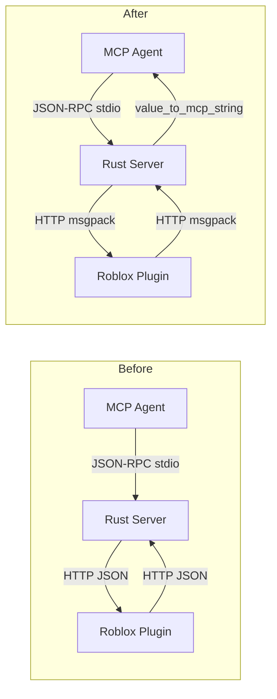

# msgpack Transport Migration

## Architecture: Before vs After




## NaN/Inf in MCP stdio - Deep Dive

The MCP protocol is JSON-RPC 2.0 over stdout. Tool results are emitted as:

```json
{"jsonrpc":"2.0","result":{"content":[{"type":"text","text":"..."}]}}
```

The `text` field is a JSON string — its contents are opaque to the protocol. JSON does not permit `NaN` or `Infinity` as number literals. However, since the entire tool result is wrapped in a `Content::text(string)`, the text may contain the **string tokens** `"NaN"`, `"Infinity"`, `"-Infinity"`. LLMs read these semantically correctly.

The conversion happens at the Rust boundary in a new `value_to_mcp_string(v: rmpv::Value) -> String` function: msgpack floats that are NaN/Inf are formatted as their string names rather than failing JSON serialization.

## Key Type Change

`RunCommandResponse.response` changes from `String` to `rmpv::Value`:

- Plugin sends the result table directly (no JSONEncode) → msgpack encodes it natively
- `response_handler` decodes the rmpv::Value and converts to String immediately (channel stays `Result<String>`)
- `dispatch` / MCP output path is unchanged

## Files to Change

### Lua / Plugin

- `[wally.toml](wally.toml)` — add `cipharius/msgpack-luau = "0.3.0"` under `[dependencies]`
- New `plugin/msgpack.luau` — thin require wrapper: `return require(script.Parent.Packages["msgpack-luau"])`
- `[plugin/MockWebSocketService.luau](plugin/MockWebSocketService.luau)` — `doRequest`: Content-Type → `"application/msgpack"`, body → `msgpack.encode(body)`; poll loop: fire `msgpack.decode(response.Body)` instead of raw string body
- `[plugin/Main.server.luau](plugin/Main.server.luau)` — remove `HttpService:JSONDecode(message)`; `message` is already a decoded table fired by MockWebSocketService; remove `HttpService` import
- `[plugin/Tools/RunScriptInPlayMode.luau](plugin/Tools/RunScriptInPlayMode.luau)` — remove `HttpService:JSONEncode(result)`, return `result` table directly
- `[plugin/Tools/RunCode.luau](plugin/Tools/RunCode.luau)` — replace `HttpService:JSONEncode(serializedArg)` inside `toStrTable` with a local `tableToString` function that handles NaN/Inf/null (this is display-string formatting inside the output text, separate from transport)
- `[plugin/Utils/Codec.luau](plugin/Utils/Codec.luau)` — export `NULL` sentinel: check if `msgpack-luau` exposes `msgpack.null`; if so re-export it, otherwise use `table.newproxy(false)`

### Rust

- `[Cargo.toml](Cargo.toml)` — add `rmp-serde = "1"` and `rmpv = { version = "1", features = ["with-serde"] }`
- `[src/server_state.rs](src/server_state.rs)`:
  - `RunCommandResponse.response: String` → `rmpv::Value`
  - Add `value_to_mcp_string(v: rmpv::Value) -> String` — recursively converts to a JSON-like string, substituting NaN/Inf float values with their string names
- `[src/rbx_studio_server.rs](src/rbx_studio_server.rs)`:
  - `request_handler`: replace `Json(result?).into_response()` with a msgpack-encoded bytes response (using `rmp_serde::to_vec_named`)
  - `response_handler`: replace `Json(payload): Json<RunCommandResponse>` with raw `axum::body::Bytes` extractor + `rmp_serde::from_slice`; call `value_to_mcp_string(payload.response)` before sending to channel
  - `proxy_handler`: same deserialization change; when building the return `RunCommandResponse`, wrap the String result as `rmpv::Value::String(...)`, serialize response with `rmp_serde`
  - `dud_proxy_loop`: replace `.json(&entry)` with `.body(rmp_serde::to_vec_named(&entry)?)` + content-type header; replace `.json::<RunCommandResponse>()` with bytes + `rmp_serde::from_slice`

