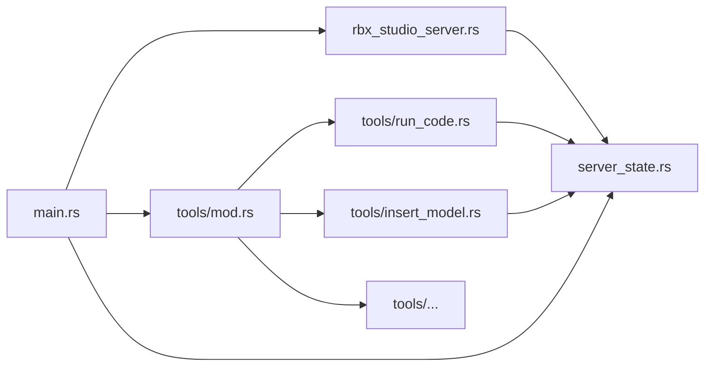

# Per-Tool Full Implementation

## Key insight: generic route functions break the circular dep

`ToolRoute::new` accepts free `FnOnce(Parameters<Args>) -> Future` handlers that don't receive `&S`. Combined with `Parameters<T>` being `FromContextPart` for any `S`, each tool's `route` fn can be generic over `S` — it doesn't need to import `RBXStudioServer` at all.

## New dependency graph (no cycles)




No tool file imports `rbx_studio_server.rs`. No cycles.

## Files to create / change

### 1. New: `src/server_state.rs`

Extract from `rbx_studio_server.rs`:

- `PackedState`, `AppState`, `ToolArguments`, `RunCommandResponse`
- `pub async fn dispatch(state: &PackedState, tool: &str, args: Value) -> Result<CallToolResult, ErrorData>` (the current `generic_tool_run` logic as a free function)

### 2. Each tool file (`src/tools/run_code.rs`)

Self-contained. Exports `pub fn route<S: Send + Sync + 'static>(state: PackedState) -> ToolRoute<S>`:

```rust
use crate::server_state::{dispatch, PackedState};
use futures::FutureExt;
use rmcp::{handler::server::{router::tool::ToolRoute, tool::schema_for_type, wrapper::Parameters}, model::Tool, schemars};
use serde::{Deserialize, Serialize};

#[derive(Debug, Deserialize, Serialize, schemars::JsonSchema, Clone)]
pub struct Args {
    #[schemars(description = "Code to run")]
    pub command: String,
}

pub fn route<S: Send + Sync + 'static>(state: PackedState) -> ToolRoute<S> {
    ToolRoute::new(
        Tool::new("run_code", "Runs a command in Roblox Studio...", schema_for_type::<Args>()),
        move |Parameters(args): Parameters<Args>| {
            let state = state.clone();
            async move { dispatch(&state, "RunCode", serde_json::to_value(args).unwrap()).await }.boxed()
        },
    )
}
```

No import of `RBXStudioServer`. Removing this file + 2 lines in `mod.rs` = tool is gone.

### 3. `src/tools/mod.rs` — the only registry

```rust
pub mod get_console_output;
pub mod get_studio_mode;
pub mod insert_model;
pub mod run_code;
pub mod run_script_in_play_mode;
pub mod start_stop_play;

use crate::server_state::PackedState;
use rmcp::handler::server::router::tool::ToolRouter;

pub fn build_router<S: Send + Sync + 'static>(state: PackedState) -> ToolRouter<S> {
    ToolRouter::new()
        .with_route(run_code::route::<S>(state.clone()))
        .with_route(insert_model::route::<S>(state.clone()))
        .with_route(get_console_output::route::<S>(state.clone()))
        .with_route(get_studio_mode::route::<S>(state.clone()))
        .with_route(start_stop_play::route::<S>(state.clone()))
        .with_route(run_script_in_play_mode::route::<S>(state.clone()))
}
```

### 4. `src/rbx_studio_server.rs` — pure infrastructure

- Remove `#[tool_router]`, remove all `#[tool]` methods, remove `ToolArgumentValues`
- `RBXStudioServer::new` receives `tool_router: ToolRouter<Self>` as parameter
- `#[tool_handler]` still works unchanged (uses `self.tool_router`)
- Still owns `get_info()` / `ServerHandler` impl and the HTTP handlers

### 5. `src/main.rs` — wire it together

```rust
let state = Arc::new(Mutex::new(AppState::new()));
let router = tools::build_router::<RBXStudioServer>(state.clone());
let server = RBXStudioServer::new(state, router);
```

## Touch points

- **Add a tool**: create `src/tools/my_tool.rs` + 2 lines in `tools/mod.rs` (`pub mod` + `.with_route(...)`)
- **Remove a tool**: delete the file + remove those 2 lines

