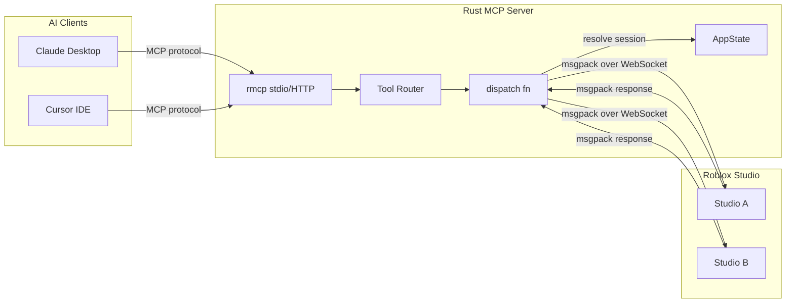
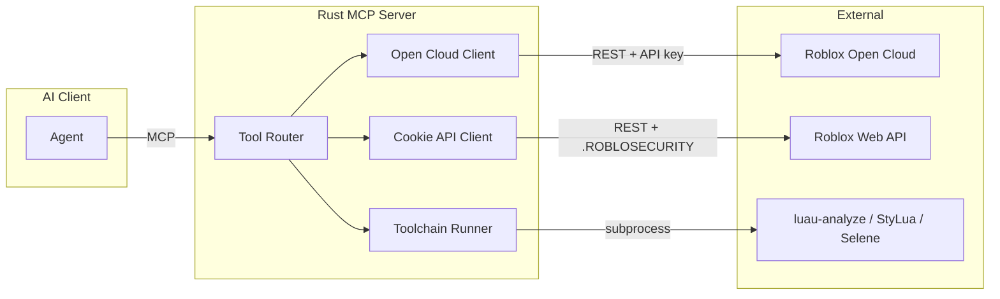

# Architecture

## Overview

A Rust MCP server that bridges AI agents (Claude Desktop, Cursor, etc.) and the Roblox ecosystem. Forked from [Roblox/studio-rust-mcp-server](https://github.com/Roblox/studio-rust-mcp-server) and diverged with:

- **msgpack wire format** instead of JSON (handles inf, nan, nil, instance refs that JSON silently drops)
- **WebSocket transport** instead of HTTP long-polling
- **Multi-studio session routing** (multiple Studio instances, each agent session isolated)
- **Typed instance codec** (786-line encoder/decoder for all Roblox types)
- **Path resolution with DebugId disambiguation** (379-line system handling relative paths, name collisions, special characters)

The server exposes four planned API surfaces:

| Surface | Transport | Status |
|---|---|---|
| Studio Plugin | WebSocket via axum | Partially shipped (6 of ~70 endpoints) |
| Open Cloud APIs | REST via reqwest | Planned (~12 endpoints) |
| Roblox Web APIs | REST via cookie auth | Planned (~10 endpoints) |
| Local Toolchain | Subprocess execution | Planned (~4 endpoints) |

## Architecture

### Data Flow



### Request Lifecycle

1. AI client sends a tool call (e.g. `run_code`) via MCP protocol
2. `tools/mod.rs` routes to the tool handler, resolving the MCP session from HTTP headers
3. Tool handler calls `dispatch()` in `server_state.rs`
4. `dispatch()` resolves which Studio to target via session state (auto-select if one connected, error if ambiguous)
5. Tool arguments are serialized to msgpack and sent over WebSocket to the plugin
6. Plugin's `ToolDispatcher.luau` routes to the correct `Tools/*.luau` handler
7. Handler executes in Studio, returns msgpack response over WebSocket
8. `dispatch()` deserializes the response and returns it to the MCP client

### Planned: Open Cloud and Cookie API Flow



## Key Design Decisions

**msgpack over JSON.** Roblox properties include inf, nan, and nil values that JSON cannot represent. Instance references are another case -- JSON has no concept of pointers. The plugin uses [msgpack-luau](https://github.com/) with a NULL sentinel for nil, and the Rust side uses `rmp-serde`/`rmpv` for deserialization. This means tool responses preserve the full fidelity of Roblox data.

**WebSocket over HTTP polling.** The original Roblox implementation uses HTTP long-polling. We switched to WebSocket for lower latency and bidirectional communication. The plugin connects to `ws://127.0.0.1:44756/ws` and the connection stays open for the session.

**Session-based multi-studio routing.** Each MCP client session (identified by `mcp-session-id` header) can target a different Studio instance. `AppState` tracks connections (keyed by server-assigned UUID) and sessions (keyed by MCP session ID). When one Studio is connected, routing is automatic. When multiple are connected, the agent must call `set_studio` to bind.

**Single-binary distribution.** Rust compiles to a single binary with no runtime dependencies. The plugin `.rbxm` is embedded via `include_bytes!` in `build.rs`. On first run, the binary installs the plugin to Studio's Plugins folder automatically.

## Current State

### Shipped Tools (9)

| Tool | Type | Description |
|---|---|---|
| `run_code` | Studio | Execute arbitrary Luau, return print output |
| `insert_model` | Studio | Search Creator Store, insert model into workspace |
| `get_console_output` | Studio | Return Studio output window contents |
| `start_stop_play` | Studio | Start/stop play mode or run server |
| `run_script_in_play_mode` | Studio | Run script in play mode, auto-stop, return structured result |
| `get_studio_mode` | Studio | Return current mode (start_play/run_server/stop) |
| `list_studios` | Meta | List all connected Studio instances with metadata |
| `get_studio` | Meta | Return which Studio the current session targets |
| `set_studio` | Meta | Bind session to a specific Studio instance |

### Codebase Inventory

**Rust** (`src/`, 14 files)

| File | Lines | Purpose |
|---|---|---|
| `main.rs` | 68 | Entry point: tracing, plugin install, axum router, server startup |
| `rbx_studio_server.rs` | 198 | WebSocket handler, Studio registration, message routing, MCP ServerHandler |
| `server_state.rs` | 233 | AppState, SessionState, dispatch function, msgpack value conversion |
| `error.rs` | 36 | Error type wrapping color_eyre with axum IntoResponse |
| `tools/mod.rs` | 36 | Tool router builder, session resolution from HTTP headers |
| `tools/run_code.rs` | 37 | run_code tool handler |
| `tools/insert_model.rs` | 37 | insert_model tool handler |
| `tools/get_console_output.rs` | 34 | get_console_output tool handler |
| `tools/start_stop_play.rs` | 39 | start_stop_play tool handler |
| `tools/run_script_in_play_mode.rs` | 46 | run_script_in_play_mode tool handler |
| `tools/get_studio_mode.rs` | 34 | get_studio_mode tool handler |
| `tools/get_studio.rs` | 65 | get_studio tool handler |
| `tools/list_studios.rs` | 43 | list_studios tool handler |
| `tools/set_studio.rs` | 86 | set_studio tool handler |

**Plugin** (`plugin-build/`, 22 Luau files, 19 source + 3 test/config)

| File | Lines | Purpose |
|---|---|---|
| `Main.server.luau` | 135 | Plugin entry: WebSocket client, registration, tool dispatch loop |
| `msgpack.luau` | 26 | msgpack-luau wrapper with NULL sentinel |
| `MockWebSocketService.luau` | 120 | Mock WebSocket for testing |
| `Tools/RunCode.luau` | 121 | Execute Luau, capture print/warn/error, handle NaN/Inf |
| `Tools/InsertModel.luau` | 109 | Search marketplace, load asset, position in workspace |
| `Tools/GetConsoleOutput.luau` | 7 | Return captured console output |
| `Tools/StartStopPlay.luau` | 81 | Control play mode via StudioTestService |
| `Tools/RunScriptInPlayMode.luau` | 114 | Inject test script, run in play mode, capture structured output |
| `Tools/GetStudioMode.luau` | 7 | Return current mode from StudioModeState |
| `Utils/Codec.luau` | 786 | Instance encoding/decoding for all Roblox types with msgpack |
| `Utils/Paths.luau` | 379 | Path resolution: relative paths, DebugId disambiguation, escaping |
| `Utils/ToolDispatcher.luau` | 22 | Auto-discover and dispatch tool handlers |
| `Utils/PluginUtils.luau` | 13 | Plugin settings wrapper |
| `Utils/ConsoleOutput.luau` | 21 | LogService capture with size limit |
| `Utils/DataModelType.luau` | 17 | Detect Edit/Client/Server DataModel |
| `Utils/GameStopUtil.luau` | 18 | Monitor and execute stop-play requests |
| `Utils/StudioModeState.luau` | 6 | Global Studio mode tracking |
| `Utils/DeepCopy.luau` | 55 | Deep copy with cycle detection |
| `Utils/DeepEquals.luau` | 76 | Deep equality with cycle detection |
| `Utils/Codec.spec.luau` | -- | Tests for Codec |
| `Utils/Paths.spec.luau` | -- | Tests for Paths |
| `jest.config.luau` | -- | Jest test configuration |

**Build and CI**

| File | Purpose |
|---|---|
| `build.rs` | Build script: Rojo sourcemap, darklua require transforms, Rojo .rbxm build |
| `Cargo.toml` | Rust manifest: rmcp, tokio, axum (WebSocket), rmp-serde, rmpv, roblox_install |
| `rokit.toml` | Toolchain pins: rojo 7.6.1, selene 0.30.0, stylua 2.3.1, wally 0.3.2, darklua 0.18.0, lune 0.10.4 |
| `.darklua.json` | Darklua config: convert require paths from "path" to "roblox" |
| `plugin.project.json` | Rojo project for source plugin directory |
| `plugin-build.project.json` | Rojo project for post-darklua plugin build |
| `.github/workflows/ci.yml` | CI: build/test on Ubuntu, Windows, macOS (+ ARM), lint (rustfmt, clippy, stylua, selene) |
| `.github/workflows/release.yml` | Release: tag, build 6 platform binaries, upload plugin to GitHub + Roblox |

### Infrastructure Already Built (Not Yet Exposed as Tools)

- **Codec.luau** (786 lines): Encodes/decodes instances with all Roblox types (Vector3, CFrame, Color3, UDim2, etc.), attributes, tags, children. Uses msgpack NULL for nil values. Path-based instance references.
- **Paths.luau** (379 lines): Resolves instance paths with relative notation (`.`, `..`, `@game`, `@self`), DebugId-based disambiguation for duplicate names, special character escaping.
- **Open Cloud Luau Execution** (`.lune/opencloud-execute/init.luau`, 521 lines): Full Open Cloud API client for Luau execution tasks. Currently used for CI testing, not yet exposed as an MCP tool.

## Planned Scope

~93 tools planned across four categories. See [TODO.txt](../TODO.txt) for full details and notes on each endpoint.

### Studio Plugin Endpoints

#### Instance Manipulation

| Endpoint | Status | Description |
|---|---|---|
| `get_instance_tree` | Planned | Instance hierarchy with typed codec output |
| `set_properties` | Planned | Set properties via msgpack (supports inf/nan/nil/refs) |
| `get_properties` | Planned | Get properties via msgpack |
| `create_instance` | Planned | Create instance with optional properties, tags, attributes |
| `delete_instances` | Planned | Delete instances by path |
| `set_parent` | Planned | Reparent instances, returns new paths |
| `clone` | Planned | Clone instances to a new parent |
| `rename_instance` | Planned | Rename instances, returns new paths |
| `query` | Planned | QueryDescendants-based instance search |
| `query_bounds` | Planned | Bounding box of Parts/Models |
| `get_size` | Planned | Size property of Parts/Models |
| `set_relative_property` | Planned | Math ops on properties (e.g. Position += Vector3) |
| `create_constraint` | Planned | Create physics constraints (may become a Skill instead) |
| `insert_r15_rig` | Planned | Insert complete R15 humanoid rig |

#### Tags and Attributes

| Endpoint | Status | Description |
|---|---|---|
| `add_tags` | Planned | Add tags to instances |
| `remove_tags` | Planned | Remove tags from instances |
| `get_tags` | Planned | Get all tags on instances |
| `get_attributes` | Planned | Get all attributes on instances |
| `set_attributes` | Planned | Set attributes via msgpack |

#### Script Editing

| Endpoint | Status | Description |
|---|---|---|
| `get_script_source` | Planned | Get script source code |
| `set_script_source` | Planned | Replace entire script source |
| `edit_script_lines` | Planned | Replace a range of lines (1-indexed, inclusive) |
| `insert_script_lines` | Planned | Insert lines at a position (0 = beginning) |
| `delete_script_lines` | Planned | Delete a range of lines (1-indexed, inclusive) |
| `search_script_source` | Planned | Grep-style search across scripts |

#### Spatial Transforms

| Endpoint | Status | Description |
|---|---|---|
| `transform_parts` | Planned | Apply CFrame (rotation + translation) |
| `translate_parts` | Planned | Move parts by Vector3 offset |
| `rotate_parts` | Planned | Rotate parts around pivot |
| `scale_parts` | Planned | Scale parts by Vector3 factor |
| `translate_frame` | Planned | Move UI frames by UDim2 |
| `scale_frame` | Planned | Scale UI frames by Vector2 |
| `rotate_frame` | Planned | Rotate UI frames by degree |

#### Terrain

| Endpoint | Status | Description |
|---|---|---|
| `fill_terrain` | Planned | Fill region with material |
| `clear_terrain` | Planned | Clear all terrain |
| `read_terrain_voxels` | Planned | Read voxel data from region |
| `write_terrain_voxels` | Planned | Write voxel data to region |
| `paint_terrain` | Planned | Paint material onto region |
| `smooth_terrain` | Planned | Smooth terrain in region |

#### Assets and Marketplace

| Endpoint | Status | Description |
|---|---|---|
| `search_assets` | Planned | Search Creator Store by type with sort/filter |
| `get_asset_details` | Planned | Marketplace metadata (creator, votes, pricing) |
| `get_asset_thumbnail` | Planned | Thumbnail as base64 PNG for vision LLMs |
| `insert_asset` | Planned | Insert by asset ID with optional position |
| `preview_asset` | Planned | Load, inspect hierarchy, destroy (peek without committing) |

#### Selection, History, and Studio

| Endpoint | Status | Description |
|---|---|---|
| `get_selections` | Planned | Get currently selected objects |
| `set_selections` | Planned | Set selection to specific paths |
| `undo` | Planned | Undo via ChangeHistoryService |
| `redo` | Planned | Redo via ChangeHistoryService |
| `history` | Planned | Browse ChangeHistoryService entries |
| `get_script_history` | Planned | Version history for a script |
| `read_script_history` | Planned | Read a historical version of a script |
| `get_place_info` | Planned | UniverseID, PlaceId, PlaceName, etc. |
| `open_place` | Planned | Open a place by PlaceId |
| `publish_place` | Planned | Publish place to Roblox |
| `health_check` | Planned | Check if Studio plugin is connected |
| `statistics` | Planned | Instance count, performance stats |

#### Screenshots and Clipboard

| Endpoint | Status | Description |
|---|---|---|
| `take_screenshot` | Planned | Intelligent cropping per instance, base64 PNG |
| `get_clipboard` | Planned | Get clipboard contents |
| `set_clipboard` | Planned | Set clipboard contents |

#### Playtesting and UI Interaction

| Endpoint | Status | Description |
|---|---|---|
| `click_button` | Planned | Simulate TextButton/ImageButton click in play mode |
| `type_text` | Planned | Simulate TextBox input in play mode |

#### Reference and Documentation

| Endpoint | Status | Description |
|---|---|---|
| `docs` | Planned | Roblox docs for a given class name |
| `schema` | Planned | Property info with inheritance, defaults, enum options |

#### Toolchain (runs locally on MCP server)

| Endpoint | Status | Description |
|---|---|---|
| `luau_analyze` | Planned | Type checking and linting via luau-analyze |
| `luau_compile` | Planned | Bytecode analysis via luau-compile |
| `stylua_format` | Planned | Format scripts with StyLua |
| `selene_check` | Planned | Lint scripts with Selene |
| `get_linter_errors` | Planned | Studio script analysis results |
| `wally_install` | Planned | Fetch Wally packages into project |

#### Unscoped / Exploratory

| Endpoint | Status | Description |
|---|---|---|
| `csg_building` | Exploratory | CSG operations (union, negate, etc.) |
| `new_studio_instance` | Exploratory | Launch a new Studio place |
| `download_place_version` | Exploratory | Download and open historical place version |
| `studio_settings` | Exploratory | Toggle physics model view and other Studio settings |
| `profiler_access` | Exploratory | Access to Studio profiler data |

### Open Cloud API Endpoints

| Endpoint | Status | Description |
|---|---|---|
| `upload_asset` | Planned | Upload asset file, optionally replace existing |
| `search_asset` | Planned | Search group for assets |
| `datastore_get` | Planned | Read from DataStore |
| `datastore_set` | Planned | Write to DataStore |
| `ordered_datastore_list` | Planned | List OrderedDataStore entries (leaderboards) |
| `ordered_datastore_set` | Planned | Set OrderedDataStore entry |
| `ordered_datastore_increment` | Planned | Atomic increment on OrderedDataStore |
| `ordered_datastore_delete` | Planned | Delete OrderedDataStore entry |
| `messaging_publish` | Planned | Publish to MessagingService across servers |
| `restart_servers` | Planned | Restart all servers for a universe |
| `get_universe` | Planned | Universe/game metadata |
| `place_configurations` | Planned | Place configuration management |
| `experience_configurations` | Planned | Experience configuration management |
| `luau_code_execution` | Planned | Execute Luau via Open Cloud API |

### Cookie Web API Endpoints

| Endpoint | Status | Description |
|---|---|---|
| `placeid_gameid` | Planned | Convert between PlaceId and GameId |
| `place_information` | Planned | Place metadata |
| `game_information` | Planned | Game metadata |
| `searching_games` | Planned | Search for games |
| `list_games_in_group` | Planned | List games owned by a group |
| `group_information` | Planned | Group metadata |
| `user_information` | Planned | User metadata |
| `search_catalog` | Planned | Search the Roblox catalog |
| `search_users` | Planned | Search for users |
| `search_toolbox` | Planned | Search the toolbox |
| `toolbox_assets` | Planned | Get toolbox asset details |

### Other Endpoints

| Endpoint | Status | Description |
|---|---|---|
| `trim_transparency` | Planned | Remove transparent borders from image |
| `resize_image` | Planned | Resize image with mode options |

### Merging UI

A cursor-style accept/reject code merging interface inside Roblox Studio. This is the most ambitious planned feature and the least defined. The goal is to enable Claude Desktop + Roblox Studio as a standalone workflow without Cursor.

## Competitive Landscape

| Project | Language | Stars | Shipped Tools | Key Differentiator |
|---|---|---|---|---|
| boshyxd/robloxstudio-mcp | TypeScript | 223 | 39 | Build Library, smart_duplicate, grep_scripts, Creator Store assets |
| CoderDayton/roblox-bridge-mcp | TypeScript/Bun | 2 | 99 | Single-tool method dispatch, lighting/camera/audio/terrain/players |
| Roblox/studio-rust-mcp-server | Rust | 365 | 6 | Official reference implementation, our fork base |
| **This project** | Rust | -- | 9 | Multi-studio, msgpack, typed codec, WebSocket, single binary |

**What we ship that nobody else does**: multi-studio session routing, msgpack wire format, typed instance codec with full Roblox type support, DebugId path disambiguation, WebSocket transport, single-binary distribution with embedded plugin.

**What we plan that nobody else has**: Open Cloud API suite, cookie-based web APIs, local Luau toolchain integration, full terrain manipulation, spatial transforms for 3D and 2D, CSG, cross-studio clipboard, merging UI.

See the `[Footnotes]` sections in [TODO.txt](../TODO.txt) for a detailed project-by-project breakdown with source-level analysis.

## Development

### Building

```
cargo run
```

This triggers `build.rs` which:
1. Generates a Rojo sourcemap from `plugin.project.json`
2. Runs darklua to transform require paths from file-relative to Roblox-style
3. Builds the plugin `.rbxm` via Rojo from `plugin-build.project.json`
4. Compiles the Rust binary with the `.rbxm` embedded via `include_bytes!`

On first run, the binary auto-installs the plugin to Studio's Plugins folder.

The server listens on `http://127.0.0.1:44756` with:
- `/ws` -- WebSocket endpoint for Studio plugin connections
- `/mcp` -- MCP endpoint for AI client connections

### Adding a New Tool

Every tool follows the same pattern:

**Rust side** (`src/tools/`): Define an `Args` struct with `schemars::JsonSchema`, create a `route()` function that builds a `ToolRoute` with name, description, and handler. The handler calls `dispatch()` which serializes args to msgpack and sends over WebSocket. Register the route in `tools/mod.rs`.

**Plugin side** (`plugin-build/Tools/`): Create a `.luau` file that returns a function `(args) -> result`. `ToolDispatcher.luau` auto-discovers it by name. The tool name on the Rust side (e.g. `"RunCode"`) must match the Luau filename (e.g. `RunCode.luau`).

### Toolchain

Pinned in `rokit.toml`:

| Tool | Version | Purpose |
|---|---|---|
| rojo | 7.6.1 | Build .rbxm plugin files, generate sourcemaps |
| darklua | 0.18.0 | Transform require paths for Roblox compatibility |
| stylua | 2.3.1 | Luau code formatting |
| selene | 0.30.0 | Luau linting |
| wally | 0.3.2 | Luau package management |
| lune | 0.10.4 | Luau script runner (CI, Open Cloud scripts) |

### CI

GitHub Actions runs on push:
- **Build and test**: Ubuntu, Windows, macOS (x86_64 + aarch64)
- **Lint**: rustfmt, clippy, stylua, selene
- **Luau tests**: Executed via Open Cloud Luau Execution API against a published test place

Release workflow builds binaries for 6 platform targets and uploads the plugin to both GitHub Releases and Roblox.
